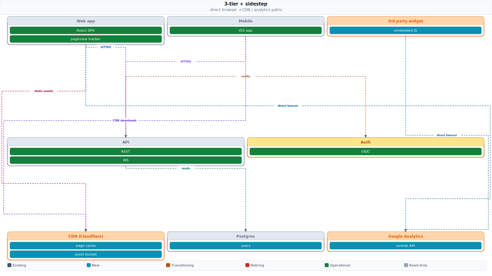

# spinediagrams

Zero-dependency Python library for generating architecture diagrams as SVG, designed to work natively with LLM-generated output.

You describe the diagram as a Python dict (or JSON). The engine renders a 1600px-wide SVG with orthogonal arrow routing through a single shared spine between rows. Arrows never cross container bodies; labels never collide. Same config in, same SVG out.

Ships as a [Claude Code skill](https://docs.claude.com/en/docs/claude-code/skills) bundle (`dist/spinediagrams.skill`). The renderer itself is a 350-line stdlib-only Python script; drop it into any project.

## Why spinediagrams

- **Deterministic.** Same config produces the same SVG. No LLM in the render loop.
- **Single-spine routing.** All arrows route through one shared zone between adjacent rows. No arrows over containers, no labels piled on each other.
- **2 or 3 rows + skip-row sidestep.** Default 2-row layout for source/target diagrams. Opt into 3 rows (`"row": 2`) for classic 3-tier. Skip-row connections (row 0 ↔ row 2) automatically route around through a margin sidestep channel so they never overlap the middle row.
- **Aspect-ratio aware.** Defaults to 16:9 (slide-friendly). Also accepts 4:3 or a numeric ratio. Extra vertical room becomes arrow spacing; the more connections you have, the more breathing room each label gets.
- **Zero deps.** Pure Python stdlib. No matplotlib, no graphviz, no node toolchain.
- **Vendor palettes built in.** AWS, GCP, Azure, Salesforce, Stripe, Postgres, Kafka, Okta, Slack, and more come with brand colors auto-applied; just use the lane key.

## Install (as a Claude Code skill)

Download `dist/spinediagrams.skill` and drop it into `~/.claude/skills/`. The file is a zip archive; unzip it first:

```bash
curl -L -o /tmp/spinediagrams.skill \
  https://github.com/wasulajr/spinediagrams/raw/main/dist/spinediagrams.skill
unzip /tmp/spinediagrams.skill -d ~/.claude/skills/
```

Then in any Claude Code session, ask for an architecture diagram. The skill triggers automatically on phrases like "draw a diagram", "show me how X connects to Y", "create a system diagram", "visualise the stack".

## Use directly (no Claude required)

```python
import sys
sys.path.insert(0, "skill/scripts")
from svg_engine import Diagram

config = {
    "title": "My System — Subtitle",
    "aspect": "16:9",
    "lanes": {
        "sf":  {"label": "Salesforce",  "col": 0, "colspan": 2, "row": 0},
        "gcp": {"label": "GCP Platform","col": 0, "colspan": 2, "row": 1},
    },
    "nodes": {
        "sf":  [["CRM", "operational"], ["Billing", "transitioning"]],
        "gcp": [["Cloud SQL", "new"], ["API Gateway", "new"]],
    },
    "connections": [
        ["sf",  "Billing",     "gcp", "Cloud SQL",   "Pub/Sub sync"],
        ["gcp", "API Gateway", "sf",  "CRM",         "Write-back"],
    ],
}

svg = Diagram(config).render()
open("output.svg", "w").write(svg)
```

Or via CLI:

```bash
python skill/scripts/svg_engine.py config.json output.svg
```

The em dash inside the `title` string above is intentional. The engine splits the title field on ` — ` to separate the title from the subtitle. The dash is API syntax, not prose punctuation.

## Config format

See [`skill/SKILL.md`](skill/SKILL.md) for the full schema. Required fields:

- `title`: the diagram title. Use ` — ` inside the string to split into title and subtitle.
- `lanes`: keyed dict of containers (each gets `col`, `colspan`, `row`, optional preset key or explicit colors)
- `nodes`: keyed dict of `[label, status]` pairs per lane
- `connections`: list of `[src_lane, src_node, dst_lane, dst_node, edge_label]`

Optional:

- `num_cols`: column count (default 6)
- `aspect`: target aspect ratio. `"16:9"` (default), `"4:3"`, or a number.

## Examples

[`examples/sf-initial-setup-agent.py`](examples/sf-initial-setup-agent.py): a real 16-connection 2-row diagram for a Salesforce metadata retrieval tool.

```bash
python examples/sf-initial-setup-agent.py
open examples/sf-initial-setup-agent.svg
```


[`examples/3-tier-web-app.py`](examples/3-tier-web-app.py): a 14-connection 3-row diagram covering frontend, backend services, data stores + externals.

```bash
python examples/3-tier-web-app.py
open examples/3-tier-web-app.svg
```


[`examples/3-tier-with-sidestep.py`](examples/3-tier-with-sidestep.py): same 3-row layout with four row 0 ↔ row 2 sidestep connections (direct browser → CDN and browser → analytics paths that bypass the backend). Demonstrates the margin-sidestep router.

```bash
python examples/3-tier-with-sidestep.py
open examples/3-tier-with-sidestep.svg
```



## Status colors

| Status | Color | Meaning |
|---|---|---|
| `existing` | Slate | Unchanged, currently live |
| `new` | Cyan | Being built / not yet live |
| `transitioning` | Amber | Partially moved / dual-write |
| `retiring` | Red | Being decommissioned |
| `operational` | Green | Fully live on new platform |
| `readonly` | Light grey | Still present but no writes |

## Contributing

PRs welcome. The whole renderer is one file ([`skill/scripts/svg_engine.py`](skill/scripts/svg_engine.py)): small, focused, no abstraction layers. Ideas:

- Smart label staggering to avoid label-on-vertical-drop occlusion
- More than 3 rows (generalize the spine + sidestep model to N rows)
- Additional vendor presets
- Pyproject + PyPI package

## License

MIT. See [LICENSE](LICENSE).
